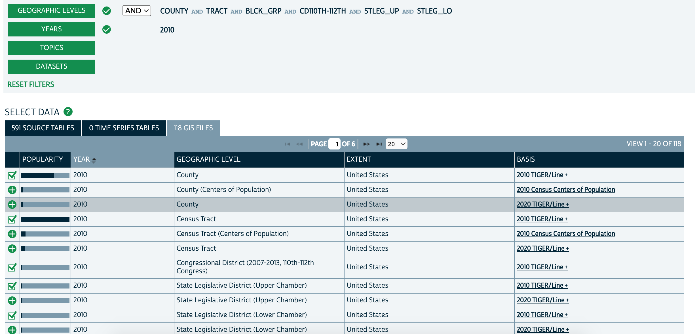

# Getting things to run

## Requirements
- Data (see [below](#getting-the-data))
- `python3`, and the following packages:
  - [numpy](https://numpy.org/)
  - [scipy](https://scipy.org/)
  - [pandas](https://pandas.pydata.org/)
  <!--- [geopandas](https://geopandas.org/en/stable/) (for swapping)-->
  - [Gurobi](https://www.gurobi.com/), with a valid license and the python package `gurobipy` installed (`python3 -m pip install gurobipy`)

## Getting the data
We'll need a combination of data from NHGIS and PUMS from the census. For a particular state:
- Get PUMS data [here](https://www2.census.gov/census_2010/12-Stateside_PUMS/)
- For NHGIS:
  1. Start [here](https://data2.nhgis.org/main)
  2. Choose dataset `2010_SF1a`
  3. Choose geographic level `Block`
  4. Choose tables `P3`, `P5`, `P16`, `P16A`--`P16H`, `P28`, and `P28A`--`P28H`. In general, we'd prefer to use the more granular `A`--`H` tables, but sometimes we'll have to fall back on the less granular ones.
  5. Click CONTINUE, and click CONTINUE again.
  6. Select the right state under GEOGRAPHIC EXTENTS
  7. SUBMIT

## Basic setup
Create a parameters file like the one below:
<!--Create a file called `params.json` in the `code/` directory.-->
<!--The input data will need to be in `[data]/[state]`, and the output will be written to `[output]/[state]`.-->
<!--`num_sols` specifies the maximum number of soluions to be returned for a block.-->
<!--`write` controls whether output files will be written.-->
<!--Make sure you set `write` to 1 before you run.-->
<!--Here's a sample:-->
```
{
    "state": "AL",
    "micro_file": "$HOME/Desktop/census_data/AL/al.2010.pums.01.txt",
    "block_file": "$HOME/Desktop/census_data/AL/block_data.csv",
    "block_clean_file": "$HOME/Desktop/census_data/AL/block_data_cleaned.csv",
    "synthetic_data": "$HOME/Desktop/census_data/output/AL/21877344_synthetic.csv",
    "synthetic_output_dir": "$HOME/Desktop/census_data/output/AL/",
    "num_sols": 1000
}
```
Call it something like `AL_params.json`.
Put it in the `synthetic-census` directory.
We'll refer to these parameters throughout these instructions.

## Storing the data
The NHGIS file you downloaded should be `nhgisxxxx_csv.zip`.
Unzip it.
Rename it `[block_file]` (in our case `$HOME/Desktop/census_data/AL/block_data.csv`).

## Pre-processing the data
Preprocess the block-level dataframe with
```
python3 preprocess.py --from_params [params_file]
```
This will create the file `[block_clean_file]`.
Computationally, this is fairly light and can be run locally.

## Building the distribution
Make sure you've fulfilled the [requirements](#requirements).
We use a map-reduce structure here.
The map stage is done by `generate_data_shard.py`, and the reduce stage is done by `aggregate_data_shards.py`.
You will likely need to use a computing cluster for this.
For a medium-sized state, it will require tens of hours of compute time.

### Running the map stage
Choose a label `[task_name]` (e.g., `AL`).
This must be admissible in a file name.
Choose a number `n` for the number of separate jobs to run.
For a medium-sized state, `n=50` is reasonable.
For `i` from 1 through `n`, run 
```
python3 generate_data_shard.py --from_params [params_file] --task i --num_tasks n --task_name [task_name]
```
This will generate the data shard `[synthetic_output_dir]/[task_name]_[i]_[n].pkl`.

<!--Run `python3 partition_blocks.py` (if running locally).-->
<!--This will create `.pkl` file in `[output]/[state]/`.-->
<!--To parallelize, run `python3 partition_blocks.py [i] [total]` for `i` in `1..total` on separate threads/machines (see below for `slurm` usage).-->
<!--If given a third argument [name], files will be named `[name]_[i]_[total].pkl`.-->
<!--Otherwise, they will be named `[i]_[total].pkl`-->
<!--To turn the `.pkl` files into a dataset, run `python3 sample_from_dist.py [name]`.-->
### Running the reduce stage
Once all of the data shards have been generated, run
```
python3 aggregate_data_shards.py --from_params [params_file] --task_name [task_name]
```
This will generate the file `[synthetic_output_dir]/[task_name]_synthetic.csv`.

## Running on a cluster with `slurm`

**Important:** If you want to run things on a cluster, make sure you follow the above instructions to put data in the correct directories.
You will need to modify your `[params_file]` to inclue the appropriate file paths for your cluster.

If using `slurm`, you can modify the following files to generate a dataset.
First, modify `shard_generation.sh`, which looks like this:

https://github.com/mraghavan/synthetic-census/blob/098f944d6b803be40c82daa48f4655ee1826968e/shard_generation.sh

Make sure you change `out_files` to a directory where you want text logs to go (and make sure that directory exists).
You may also need to load appropriate python modules (including `gurobipy`).
Depending on the size of the state, you may need to modify the resources allocated to each job (increase compute time, memory, etc.).

Then, modify `shard_aggregation.py`, which looks like this:

https://github.com/mraghavan/synthetic-census/blob/refactor/shard_aggregation.sh

Again, make sure the text logs go to a valid directory and that appropriate modules are loaded if necessary.
The reduce phase is probably computationally light enough to run locally, but you'd have to copy over all the `.pkl` files produced by the map phase to do this.

When this is done, you can run
```
./generate_dataset.sh [task_name]
```

This will set up both the map and reduce jobs and produce the dataset `[synthetic_output_dir]/[task_name]_synthetic.csv`.
<!--This will use a map-reduce-style approach to generate a single dataset, which will be written to `[output]/[state]/[job_id]_synthetic.csv`, where `job_id` is the first line of the script's output.-->
<!--Make sure the directory `code/out_files` exists before running.-->


# Data schema
Each row in the synthetic dataset corresponds to a single household.
The synthetic dataset has the following columns:
| Name | Description|
|---|---|
|`YEAR`|(from NHGIS data) |
|`STATE`|(from NHGIS data) |
|`STATEA`|(from NHGIS data) |
|`COUNTY`|(from NHGIS data) |
|`COUNTYA`|(from NHGIS data) |
|`COUSUBA`|(from NHGIS data) |
|`TRACTA`|(from NHGIS data) |
|`BLKGRPA`|(from NHGIS data) |
|`BLOCKA`|(from NHGIS data) |
|`NAME`|(from NHGIS data) |
|`BLOCK_TOTAL`| Total number of people in that block |
|`BLOCK_18_PLUS`| Total number of 18+ people in that block (NOTE: this doesn't necessarily match NHGIS data. See `AGE_ACCURACY`.) |
|`TOTAL`| Total number of people in this household |
|`W`| Total number of people in this household of race 'White alone' |
|`B`|Total number of people in this household of race 'Black or African American alone' |
|`AI_AN`|Total number of people in this household of race 'American Indian and Alaska Native alone' |
|`AS`|Total number of people in this household of race 'Asian alone' |
|`H_PI`|Total number of people in this household of race 'Native Hawaiian and Other Pacific Islander alone' |
|`OTH`|Total number of people in this household of race 'Some Other Race alone' |
|`TWO_OR_MORE`|Total number of people in this household of race 'Two or More Races' |
|`NUM_HISP`| Number of Hispanic people in this household |
|`18_PLUS`| Total number of people in this household aged 18 or more |
|`HH_NUM`| Household index within block |
|`ACCURACY`| How accurate a solver was used (1, 2, or 3; see below)|
|`AGE_ACCURACY`| Whether this block had accurate age information |
|`identifier`| Unique block ID |

`ACCURACY = 1` means the households match the NHGIS data in terms of:
- Total number of people of each race X Hispanic combination in the block (see table `P5`)
- Number of households of each (householder race, family status, size) type (see tables `P28A`--`H`)
- (if `AGE_ACCURACY` is true) Number of people age 18+ living in a household for each householder race and ethnicity (see tables `P16A`--`H`)

`ACCURACY = 2` means the households match the NHGIS data in terms of:
- Total number of people of each race X Hispanic combination in the block (see table `P5`)
- Total number of households (see table `P28`)
- (if `AGE_ACCURACY` is true) Total number of people 18+ (see table `P16`)

`ACCURACY = 3` means the households match the NHGIS data in terms of:
- Total number of people of each race in the block (see table `P3`)
- Total number of Hispanic people of each race in the block (see table `P5`)
- (if `AGE_ACCURACY` is true) Total number of people 18+ (see table `P16`)

`AGE_ACCURACY` is true if tables `P3` and `P16` agree on the total number of residents in the block, and false otherwise. In VT, this is true for ~98% of blocks.

# Swapping

First, download the 2010 shapefiles from [NHGIS](https://data2.nhgis.org/main).
- Download the US shapefiles for County, Census Tract, Congressional District 2008-2013, 110th-112th Congress, State Legislative District (Upper Chamber), State Legislative District (Lower Chamber). See the image below. Unzip all of these files into `[data]/US/shapefiles`.

- Download the state shapefiles.
  - Enter `BLCK_GRP OR BLOCK` into Geographic Levels and set the year to 2010.
  - Find the `2010 TIGER/LINE +` shapefile for the state in question in the GIS FILES tab.
  - Unzip all the files into `[data]/[state]/shapefiles`.

For all of these, make sure to download `2010 TIGER/LINE +` files.

To get swapped data, name the synthetic dataset `[output]/[state]/[name]_synthetic.csv`.
Run `python3 swapping.py [name]`, which will run swap the dataset and write the resulting dataset to `[output]/[state]/[name]_swapped.csv`.

The swapping parameters (including the swap rate) can be found and edited in `swapping_params.json`.

## Running on slurm
To run on slurm, first create a `conda` environment with the following commands:
```
conda create --name geopandas
source activate geopandas
conda install geopandas
```
Then, run `sbatch swap_script.sh`.

(Harvard's cluster seems to require `conda` because the standard `python3` won't allow the installation of `geopandas` for some reason.
In the future, it may be worth re-trying to avoid the added hassle of `conda`.)

# ToyDown

This needs to be expanded.

Basic instructions:
- Run `python3 hh_to_person_microdata.py [name]`.
- Run `python3 run_toydown.py [name] 1 1 1 equal` (or with other parameters).

# How it works
To be written
